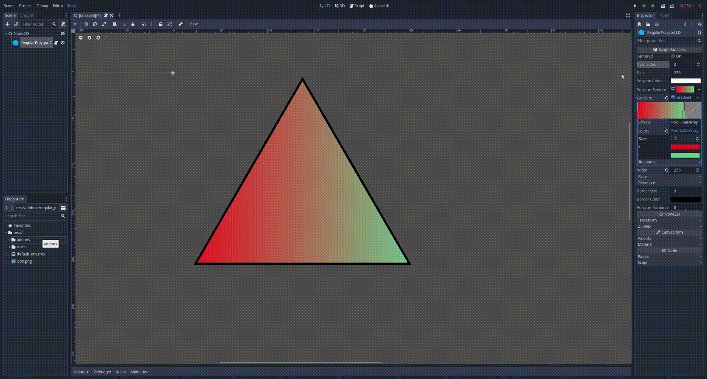
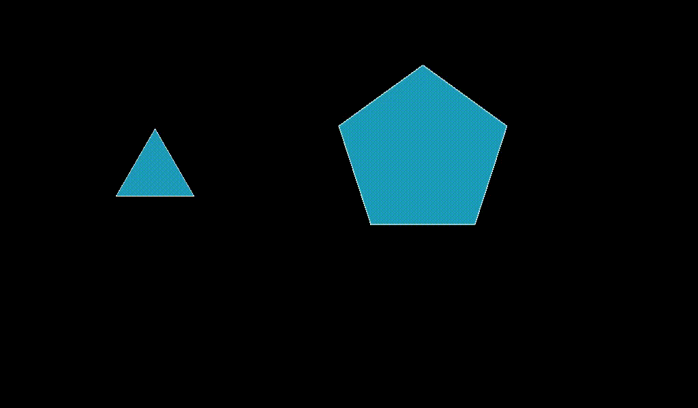

# Godot_RegularPolygon2D
RegularPolygon2D Node for Godot game Engine. Quickly create polygons with equal sides and angles.

Supports borders and textures.

And automatic collision shape configuration.

